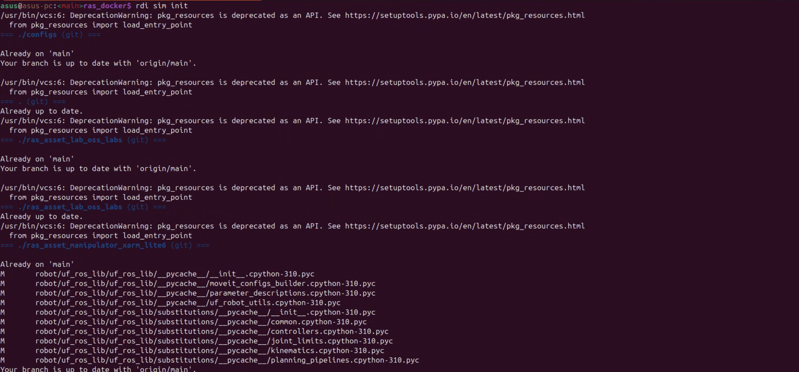
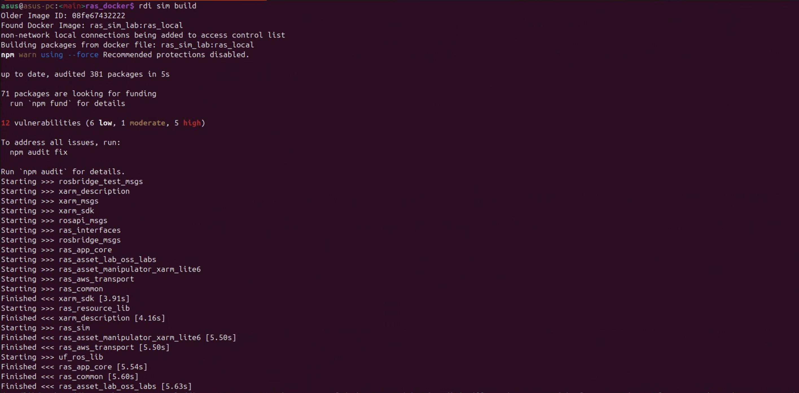
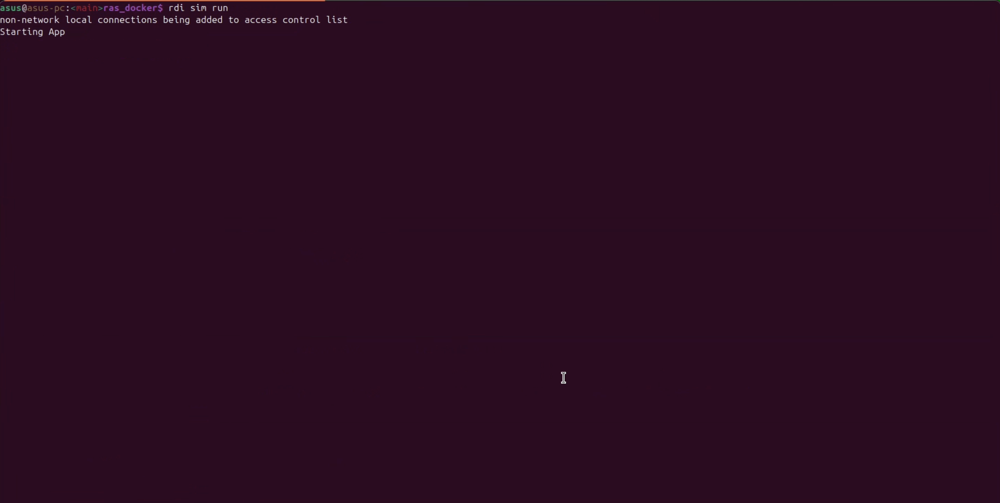
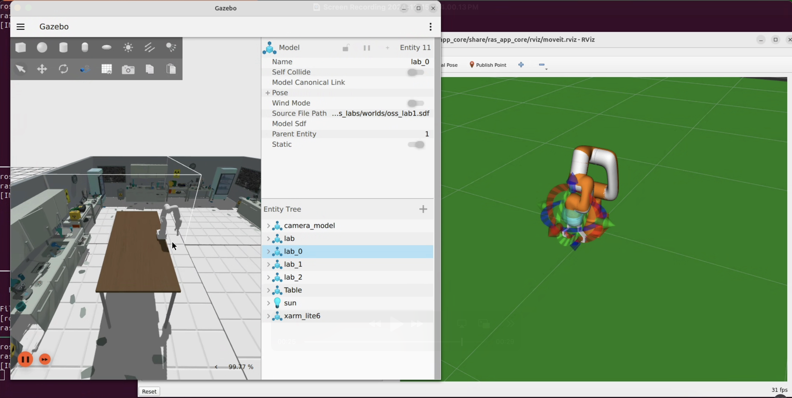
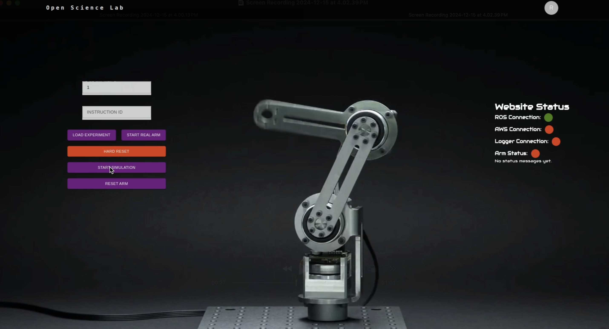

Sim Examples
============

The **sim** examples are designed to work with the Ignition Gazebo simulator. The examples are located in the `ras_sim_lab` directory under the `apps` folder.

To get started with the examples, follow the steps below:

1. After the installation of RAS, initialize the **sim** application by running the following command:
-------------------------------------------------------------------------------------------------------
.. code-block:: bash

    rdi sim init

`rdi sim init` will first pull application specific repository, then pull it's dependencies, and after that, pull docker image

2. Build the ros packages for the **sim** application by running the following command:
--------------------------------------------------------------------------------------------
.. code-block:: bash

    rdi sim build

To build the docker image use `--force` argument with command:

.. code-block:: bash

    rdi sim build --force

3. Start the **sim** application by running the following command:
------------------------------------------------------------------
.. code-block:: bash

    rdi sim run

It will start the Ignition Gazebo simulator, rviz, and other necessary components. You can now interact with the simulator.

4. To start the experiment, open the following URL in your browser:
--------------------------------------------------------------------

    `localhost:5173 <http://localhost:5173>`_

Then enter *1* in the **Experiment ID** field and click **LOAD EXPERIMENT**. After that click **START SIMULATION** to start the experiment.

The robot arm will perform the motion in the simulation and trajectory will be displayed in the rviz.